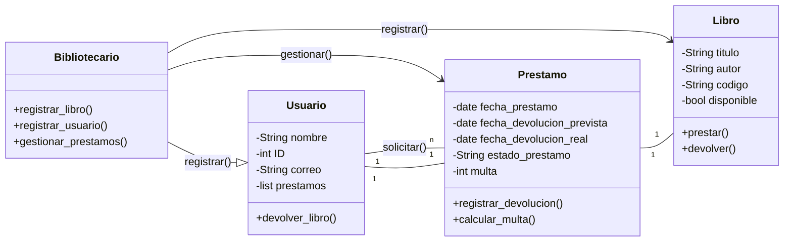

---
config:
  theme: neo-dark
---

```mermaid
classDiagram
  direction LR

  class Libro {
    -String titulo
    -String autor
    -String codigo
    -bool disponible
    +prestar()
    +devolver()
  }

  class Usuario {
    -String nombre
    -int ID
    -String correo
    -list prestamos
    +devolver_libro()
  }

  class Bibliotecario {
    +registrar_libro()
    +registrar_usuario()
    +gestionar_prestamos()
  }

  class Prestamo {
    -date fecha_prestamo
    -date fecha_devolucion_prevista
    -date fecha_devolucion_real
    -String estado_prestamo
    -int multa
    +registrar_devolucion()
    +calcular_multa()
  }

  Bibliotecario --> Prestamo : gestionar()
  Bibliotecario --> Libro : registrar()
  Bibliotecario --|> Usuario : registrar()
  Usuario "1" -- "n" Prestamo : solicitar()
  Prestamo "1" -- "1" Libro
  Prestamo "1" -- "1" Usuario
```