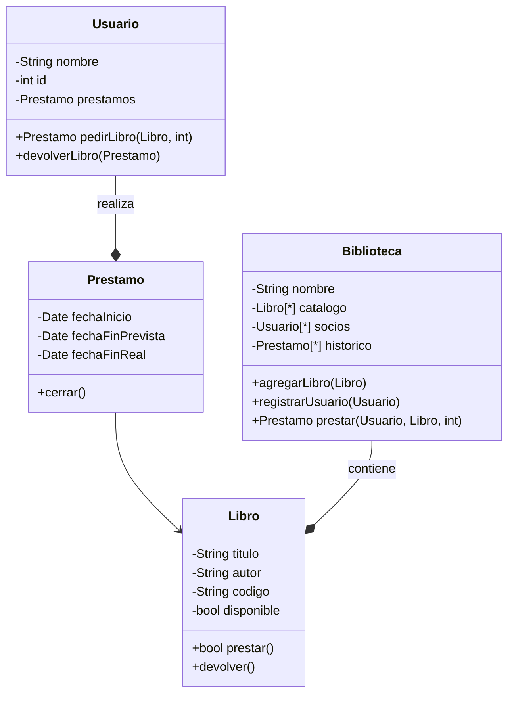

```mermaid
classDiagram
    direction TB

    class Libro {
        -String titulo
        -String autor
        -String codigo
        -bool disponible
        +bool prestar()
        +devolver()
    }

    class Usuario {
        -String nombre
        -int id
        -Prestamo prestamos
        +Prestamo pedirLibro(Libro, int)
        +devolverLibro(Prestamo)
    }

    class Prestamo {
        -Date fechaInicio
        -Date fechaFinPrevista
        -Date fechaFinReal
        +cerrar()
    }


    class Biblioteca {
        -String nombre
        -Libro[*] catalogo
        -Usuario[*] socios
        -Prestamo[*] historico
        +agregarLibro(Libro)
        +registrarUsuario(Usuario)
        +Prestamo prestar(Usuario, Libro, int)
    }

    Usuario      --*  Prestamo   : realiza
    Prestamo     -->     Libro
    Biblioteca   --*  Libro      : contiene

```
